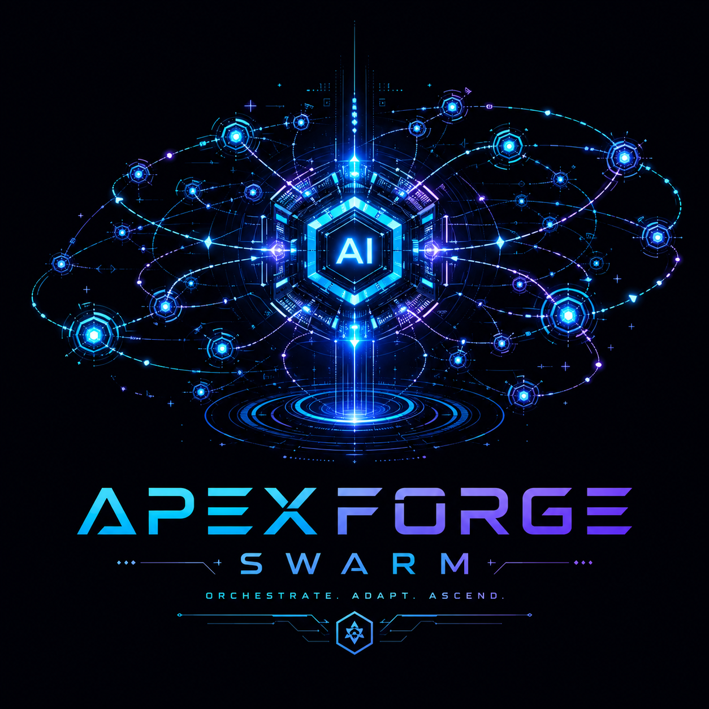

<div align="center">



```
 █████╗ ██████╗ ███████╗██╗  ██╗███████╗ ██████╗ ██████╗  ██████╗ ███████╗
██╔══██╗██╔══██╗██╔════╝╚██╗██╔╝██╔════╝██╔═══██╗██╔══██╗██╔════╝ ██╔════╝
███████║██████╔╝█████╗   ╚███╔╝ █████╗  ██║   ██║██████╔╝██║  ███╗█████╗
██╔══██║██╔═══╝ ██╔══╝   ██╔██╗ ██╔══╝  ██║   ██║██╔══██╗██║   ██║██╔══╝
██║  ██║██║     ███████╗██╔╝ ██╗██║     ╚██████╔╝██║  ██║╚██████╔╝███████╗
╚═╝  ╚═╝╚═╝     ╚══════╝╚═╝  ╚═╝╚═╝      ╚═════╝ ╚═╝  ╚═╝ ╚═════╝ ╚══════╝

███████╗██╗    ██╗ █████╗ ██████╗ ███╗   ███╗
██╔════╝██║    ██║██╔══██╗██╔══██╗████╗ ████║
███████╗██║ █╗ ██║███████║██████╔╝██╔████╔██║
╚════██║██║███╗██║██╔══██║██╔══██╗██║╚██╔╝██║
███████║╚███╔███╔╝██║  ██║██║  ██║██║ ╚═╝ ██║
╚══════╝ ╚══╝╚══╝ ╚═╝  ╚═╝╚═╝  ╚═╝╚═╝     ╚═╝
```

### Local-first · Tool-first · Multi-Agent · No Cloud Required

<p>
  
  
  
  
  
</p>

**ApexForge Swarm** turns a local model into a system that can inspect, execute, plan, coordinate, and deliver real work — without sending your data anywhere.

[Quick Start](#quick-start) · [Architecture](#architecture) · [Backends](#backends) · [Multi-Agent](#multi-agent-system) · [RAG](#rag--knowledge-base) · [Desktop War Room](#desktop-war-room) · [Configuration](#configuration-guide) · [Roadmap](#roadmap)

</div>

---

## What's New

```
┌──────────────────────────────────────────────────────────────────────────┐
│                         RECENT PLATFORM UPGRADES                        │
├──────────────────────────────┬───────────────────────────────────────────┤
│ CLI Reliability              │ Execution follow-ups now carry context   │
│                              │ Short prompts like "do it" / "yap" keep  │
│                              │ the original real-machine task alive      │
├──────────────────────────────┼───────────────────────────────────────────┤
│ Tool Honesty                 │ File-creation claims are no longer        │
│                              │ accepted without actual tool evidence     │
├──────────────────────────────┼───────────────────────────────────────────┤
│ llama.cpp UX                 │ Startup noise in CLI is softened          │
│                              │ Optional preflight shows server startup   │
├──────────────────────────────┼───────────────────────────────────────────┤
│ Desktop War Room             │ Cleaner layout, smaller board density,    │
│                              │ sticky controls, runtime diagnostics pane │
├──────────────────────────────┼───────────────────────────────────────────┤
│ API Serve Mode               │ New `--serve` mode for API-first local    │
│                              │ service usage, plus `/api/chat` endpoint  │
└──────────────────────────────┴───────────────────────────────────────────┘
```

### At A Glance

```text
CLI request
   │
   ├─▶ Tool-required task?
   │       │
   │       ├─ yes  → enforce tool usage → verify result
   │       └─ no   → normal chat response
   │
   └─▶ llama.cpp startup?
           │
           ├─ optional preflight → "starting local model server..."
           └─ then normal generation / tool loop
```

---

## What Makes This Different From Ollama

```
Ollama                           ApexForge Swarm
──────                           ─────────
Chat completions API    vs.      Full agentic execution loop
Pull & run models       vs.      Tool-first task execution
Single model serving    vs.      Multi-backend (Ollama + llama.cpp + OpenAI compat)
No memory/context       vs.      Persistent memory + skills system
No multi-agent          vs.      Supervisor + parallel workers
API only                vs.      CLI + Web UI + Desktop War Room
No RAG                  vs.      ChromaDB vector search (local)
```

ApexForge Swarm is not a model server. It is a local AI agent platform built on top of model servers.

---

## Architecture

```
╔══════════════════════════════════════════════════════════════════════════╗
║                         USER INTERFACES                                  ║
║  ┌─────────────┐   ┌──────────────────┐   ┌───────────────────────────┐ ║
║  │   CLI       │   │   Web UI         │   │   Desktop War Room        │ ║
║  │  cli.py     │   │  FastAPI+WebSocket│   │  pywebview + comic_ui     │ ║
║  │             │   │  /ws streaming   │   │  Mission board            │ ║
║  └──────┬──────┘   └────────┬─────────┘   └─────────────┬─────────────┘ ║
╚═════════╪══════════════════╪═════════════════════════════╪═══════════════╝
          │                  │                             │
          └──────────────────┼─────────────────────────────┘
                             │
╔════════════════════════════╪═════════════════════════════════════════════╗
║                     CORE ENGINE                                          ║
║           ┌─────────────────────────────────┐                           ║
║           │         agent/core.py           │                           ║
║           │  ┌─────────────────────────┐    │                           ║
║           │  │  Chat Loop              │    │                           ║
║           │  │  • tool calling         │    │                           ║
║           │  │  • streaming            │    │                           ║
║           │  │  • context compression  │    │                           ║
║           │  │  • thought tag parsing  │    │                           ║
║           │  │  • interrupt/cancel     │    │                           ║
║           │  └─────────────────────────┘    │                           ║
║           └─────────────────────────────────┘                           ║
║                             │                                            ║
║        ┌────────────────────┼────────────────────┐                      ║
║        │                   │                    │                       ║
║ ┌──────▼──────┐   ┌────────▼────────┐   ┌──────▼──────┐               ║
║ │ LLM Backend │   │  Tool Executor  │   │   Memory    │               ║
║ │             │   │  + Fallbacks    │   │  + Skills   │               ║
║ │ Ollama      │   │                 │   │             │               ║
║ │ llama.cpp   │   │ shell→py→js     │   │ 2-layer     │               ║
║ │ OpenAI compat│  │ auto-fallback   │   │ global+prof │               ║
║ └─────────────┘   └─────────────────┘   └─────────────┘               ║
╚══════════════════════════════════════════════════════════════════════════╝
                             │
╔════════════════════════════╪═════════════════════════════════════════════╗
║                  MULTI-AGENT LAYER                                       ║
║           ┌─────────────────────────────────┐                           ║
║           │    MultiAgentSystem             │                           ║
║           │                                 │                           ║
║           │  ┌──────────┐  ┌─────────────┐ │                           ║
║           │  │Supervisor│  │  Workers    │ │                           ║
║           │  │          │  │ (parallel)  │ │                           ║
║           │  │ Plan     │  │ Worker_1    │ │                           ║
║           │  │ Review   │  │ Worker_2    │ │                           ║
║           │  │ Finalize │  │ Worker_N    │ │                           ║
║           │  └──────────┘  └─────────────┘ │                           ║
║           └─────────────────────────────────┘                           ║
╚══════════════════════════════════════════════════════════════════════════╝
```

---

## Quick Start

### 60-Second Setup

```bash
git clone https://github.com/ApexForgeTech/ApexForge_Swarm.git
cd ApexForge_Swarm
chmod +x setup.sh && ./setup.sh
source .venv/bin/activate
cp .env.example .env
# Edit .env and choose a backend
python main.py
```

### Backend Selection

**Ollama (Easiest):**
```bash
ollama pull qwen2.5:7b
```
```env
LLM_PROVIDER=ollama
OLLAMA_HOST=http://localhost:11434
OLLAMA_MODEL=qwen2.5:7b
OLLAMA_NUM_CTX=16384
```

**llama.cpp (Most Powerful Local GGUF Path):**
```env
LLM_PROVIDER=llama_cpp
LLAMA_CPP_HOST=http://127.0.0.1:8081
LLAMA_CPP_MODEL_PATH=/path/to/model.gguf
LLAMA_CPP_AUTO_START=true
LLAMA_CPP_NUM_CTX=32768
LLAMA_CPP_MAX_TOKENS=2048
LLAMA_CPP_REQUEST_TIMEOUT=600
# Optional: CLI first shows "starting local model server..."
APEXFORGE_CLI_BACKEND_PREFLIGHT=true
```

**llama.cpp Multi-Host (Real Parallel Workers):**
```env
LLM_PROVIDER=llama_cpp
LLAMA_CPP_HOSTS=http://127.0.0.1:8081,http://127.0.0.1:8082
LLAMA_CPP_MODEL_PATH=/path/to/model.gguf
LLAMA_CPP_AUTO_START=true
LLAMA_CPP_NUM_CTX=32768
```
Use this when you want ApexForge Swarm to spread supervisor/workers across multiple `llama-server` instances. If a mission requests more distinct models than available hosts, ApexForge safely normalizes the team for that run.

**OpenAI / Groq / Mistral / LM Studio:**
```env
LLM_PROVIDER=openai_compat
OPENAI_COMPAT_API_KEY=sk-your-key-here
OPENAI_COMPAT_MODEL=gpt-4o-mini

# Groq (ultra-fast inference):
# OPENAI_COMPAT_BASE_URL=https://api.groq.com/openai/v1
# OPENAI_COMPAT_API_KEY=gsk_...
# OPENAI_COMPAT_MODEL=llama-3.3-70b-versatile

# LM Studio (fully local + OpenAI API):
# OPENAI_COMPAT_BASE_URL=http://localhost:1234/v1
# OPENAI_COMPAT_API_KEY=lm-studio
```

### Getting a Model (Without Ollama)

If you use `llama_cpp` as your backend, Ollama is **not needed** to load the main model.
There are two ways to point llama.cpp at a model:

**Option 1 — Local GGUF file (recommended)**

Download any GGUF from [HuggingFace](https://huggingface.co/models?search=gguf) (e.g. bartowski or lmstudio-community repos), then set the path:

```env
LLAMA_CPP_MODEL_PATH=/path/to/qwen2.5-3b-instruct-q4_k_m.gguf
LLAMA_CPP_AUTO_START=true
```

```bash
# Example: download with wget
wget -P ~/.local/share/models \
  https://huggingface.co/bartowski/Qwen2.5-3B-Instruct-GGUF/resolve/main/Qwen2.5-3B-Instruct-Q4_K_M.gguf
```

**Option 2 — HuggingFace model ID (llama-server downloads automatically)**

Set a HuggingFace repo ID instead of a file path — llama-server fetches the model on first start:

```env
LLAMA_CPP_HF_MODEL=Qwen/Qwen2.5-3B-Instruct-GGUF
LLAMA_CPP_AUTO_START=true
```

> This uses llama-server's built-in `-hf` flag. The model is cached locally after the first download.

**Summary:**

```
Need Ollama?
  Main LLM inference   → No  (llama.cpp uses GGUF directly)
  RAG embeddings       → Yes (unless you disable RAG)
```

### Recommended Start Paths

```text
Want the simplest local setup?        → Ollama
Want a dedicated local GGUF server?   → llama.cpp
Want cloud or OpenAI-compatible APIs? → openai_compat
Want a local service endpoint?        → python main.py --serve
```

---

## Backends

```
┌───────────────────────────────────────────────────────────────┐
│                      BACKEND COMPARISON                        │
├────────────────┬─────────┬─────────────┬──────────────────────┤
│ Feature        │ Ollama  │ llama.cpp   │ OpenAI Compat        │
├────────────────┼─────────┼─────────────┼──────────────────────┤
│ Setup          │ Easy    │ Medium      │ Easy (API key)       │
│ Privacy        │ Local   │ Local       │ Cloud (optional)     │
│ Speed          │ Good    │ Fastest     │ Very Fast (Groq)     │
│ Streaming      │ Yes     │ Yes         │ Yes                  │
│ Tool calling   │ Yes     │ Yes         │ Yes                  │
│ Model choice   │ Many    │ Any GGUF    │ GPT-4o, Claude, etc. │
│ Auto-start     │ No      │ Yes         │ No                   │
│ Multi-agent    │ Parallel│ Serialized  │ Parallel             │
│ Local discovery│ Yes     │ Yes         │ No                   │
│ RAG embeddings │ Built-in│ Needs Ollama│ Needs Ollama         │
└────────────────┴─────────┴─────────────┴──────────────────────┘
```

### Backend Auto-Detection

ApexForge Swarm checks available backends at startup:

```
[startup] Checking backends...
  ✓ ollama     — http://localhost:11434 (3 models)
  ✓ llama_cpp  — http://127.0.0.1:8081 (ready)
  ✗ openai     — no API key configured
[startup] Active: llama_cpp
```

---

## Run Modes

### Interactive CLI
```bash
python main.py
python main.py --profile work          # named profile
python main.py --resume                # resume last session
python main.py --session 20260506_142015
```

### One-Shot Prompt
```bash
python main.py -p "list current files"
python main.py -p "analyze this repository" --plain
```

### Parallel Prompts
```bash
python main.py \
  --parallel-prompt "summarize this project" \
  --parallel-prompt "list the main modules" \
  --plain
```

### Multi-Agent Mission
```bash
python main.py --multi-agent -p "review this codebase and suggest improvements"

# With a mission template:
python main.py --multi-agent --template code_review -p "review agent/core.py"
```

### Web UI
```bash
python main.py --web
# → http://127.0.0.1:8080
```

### API Serve
```bash
python main.py --serve
# → API root on http://127.0.0.1:8080
# → OpenAPI docs on http://127.0.0.1:8080/docs
```

### CLI Preflight For llama.cpp
```bash
APEXFORGE_CLI_BACKEND_PREFLIGHT=true \
LLAMA_CPP_AUTO_START=true \
python main.py
```

This keeps the current CLI flow intact while showing a friendlier startup phase before the first generation.

### Desktop War Room
```bash
python main.py --desktop
# Fallback if `pywebview` is unavailable:
APEXFORGE_ALLOW_DESKTOP_WEB_FALLBACK=true python main.py --desktop
```

---

## Multi-Agent System

### How It Works

```
User Request
     │
     ▼
┌────────────────────────────────────────────────────────────┐
│                    ROUND 1                                  │
│                                                            │
│  Supervisor                                                │
│  ├─ Plans mission                                          │
│  ├─ Assigns tasks to workers                               │
│  └─ Defines success criteria                               │
│                         │                                  │
│         ┌───────────────┼───────────────┐                  │
│         ▼               ▼               ▼                  │
│    Worker_1        Worker_2        Worker_3                │
│    (parallel)      (parallel)      (parallel)              │
│    executes        executes        executes                │
│    tools           tools           tools                   │
│         │               │               │                  │
│         └───────────────┼───────────────┘                  │
│                         ▼                                  │
│  Supervisor reviews worker reports                         │
│  ├─ "complete" → Final answer → Done                       │
│  └─ "revise"  → Round 2 with targeted feedback             │
└────────────────────────────────────────────────────────────┘
     │
     ▼
Final Answer (max 3 rounds)
```

### Mission Templates

```bash
# Code Review
python main.py --multi-agent --template code_review \
  -p "review the authentication module"

# Research
python main.py --multi-agent --template research \
  -p "research the best local embedding models for RAG"

# Repo Audit
python main.py --multi-agent --template repo_audit \
  -p "audit this entire repository"

# Document Processing
python main.py --multi-agent --template document_processing \
  -p "process and summarize the attached report"
```

**Available templates:**

```
code_review        — Security + Architecture + Test Coverage analysts
research           — Web Researcher + Analyst + Fact Checker
repo_audit         — Codebase Explorer + Risk Analyst + Planner
document_processing— Content Extractor + Summarizer + Action Items
```

### Custom Team

```bash
python main.py --multi-agent \
  --supervisor "Project Lead" \
  --worker "Backend Developer" \
  --worker "Frontend Developer" \
  --worker "DevOps Engineer" \
  -p "plan the deployment of this application"
```

---

## Tool System

### Built-in Tools

```
┌─────────────────────────────────────────────────────────────┐
│                        TOOL MAP                              │
├───────────────────┬────────────────────────────────────────-┤
│ Category          │ Tools                                    │
├───────────────────┼──────────────────────────────────────────┤
│ Files             │ read_file, write_file, edit_file,        │
│                   │ list_directory, search_files             │
├───────────────────┼──────────────────────────────────────────┤
│ Shell             │ run_shell (bash commands)                │
├───────────────────┼──────────────────────────────────────────┤
│ Code Execution    │ run_python, run_javascript               │
├───────────────────┼──────────────────────────────────────────┤
│ Documents         │ read_document (pdf, docx, xlsx, csv)     │
├───────────────────┼──────────────────────────────────────────┤
│ Web               │ fetch_url, web_search                    │
├───────────────────┼──────────────────────────────────────────┤
│ Memory            │ remember, recall                         │
├───────────────────┼──────────────────────────────────────────┤
│ RAG               │ rag_ingest, rag_search                   │
└───────────────────┴──────────────────────────────────────────┘
```

### Tool Fallback System

When a tool fails, ApexForge Swarm automatically tries alternatives:

```
search_files fails
       │
       ├─▶ run_shell (rg / grep)
       │          │
       │          ├─▶ Succeeds → Return result
       │          └─▶ Fails
       │                  │
       ├─▶ run_python (pathlib + regex)
       │          │
       │          ├─▶ Succeeds → Return result
       │          └─▶ Fails
       │
       └─▶ run_javascript (fs.readFileSync)
```

Same fallback chain exists for: `list_directory`, `read_file`, `fetch_url`, `web_search`, `edit_file`, `read_document`.

---

## RAG — Knowledge Base

ApexForge Swarm includes a local vector search system for working with large document collections that don't fit in the model's context window.

### Setup

```bash
pip install chromadb pypdf
ollama pull nomic-embed-text   # local embedding model (for RAG only)
```

> **Important for llama.cpp / openai_compat users:**
> `nomic-embed-text` is used **only for RAG embeddings**, not for main LLM inference.
> Even if your main backend is `llama_cpp` or `openai_compat`, you still need a running
> Ollama instance locally to generate embeddings — unless you configure a different
> `embed_backend` in `config.yaml`:
>
> ```yaml
> rag:
>   embed_backend: ollama          # requires local Ollama
>   embed_model: nomic-embed-text
> ```
>
> If you do not use RAG at all, Ollama is **not required** for any backend.

### Usage

```bash
# Ingest a document
python main.py -p "ingest /path/to/report.pdf into the knowledge base"

# Query the knowledge base
python main.py -p "search the knowledge base for authentication best practices"

# Large codebase analysis
python main.py -p "ingest the entire src/ directory, then find all database queries"
```

### How It Works

```
Document
   │
   ▼ chunk (500 words, 50 overlap)
Chunks
   │
   ▼ nomic-embed-text (local, via Ollama)
Vectors
   │
   ▼ ChromaDB (persistent, local)
Vector Store
   │
   ▼ semantic search at query time
Top-K Relevant Chunks
   │
   ▼ injected into agent context
Answer
```

---

## Memory & Skills

### Memory System (2-Layer)

```
┌─────────────────────────────────────┐
│           Profile Layer             │  ← profiles/NAME/memory/
│  (overrides global for this user)   │
├─────────────────────────────────────┤
│           Global Layer              │  ← memory/
│  (shared across all profiles)       │
└─────────────────────────────────────┘
```

```bash
# The agent will remember this for later sessions
> remember that the database host is db.internal:5432

# Future sessions can recall it
> what's the database host?
→ db.internal:5432
```

### Skills System

Skills are persistent behavioral rules injected into every prompt:

```
skills/
├── coding.md          # coding standards
├── git_workflow.md    # git rules
├── file_editing.md    # file editing guidance
└── model_selection.md # which model to use when
```

```yaml
# skills/coding.md frontmatter
---
title: Coding Standards
priority: high        # critical | high | normal | low
summary: Follow these rules when writing or editing code
triggers:
  - user asks to write code
  - user asks to edit a file
mandatory:
  - Write no unnecessary comments
  - Prefer editing existing files over creating new ones
---
```

---

## Desktop War Room

The visual command center for multi-agent missions.

### Current UX Direction

```text
Desktop mode is now optimized for:
1. Fast setup at the top
2. Mission board on the left
3. Transcript and live output on the right
4. Sticky mission composer at the bottom
5. Runtime diagnostics without breaking the flow
```

```
╔═══════════════════════════════════════════════════════════════╗
║              ◈  APEXFORGE WAR ROOM  ◈                        ║
║═══════════════════════════════════════════════════════════════║
║  Mission: "Review authentication module"  [Round 2/3]  ◼STOP ║
║  Progress: ████████████░░░░░░ 65%                             ║
╠═══════════════════════════════════════════════════════════════║
║                                                               ║
║       ┌──────────────┐                                        ║
║       │  SUPERVISOR  │  Planning → Assigning → Reviewing      ║
║       │  Sr. Reviewer│                                        ║
║       └──────┬───────┘                                        ║
║              │ assigns                                         ║
║    ┌─────────┼─────────┐                                      ║
║    ▼         ▼         ▼                                       ║
║ ┌───────┐ ┌───────┐ ┌───────┐                                 ║
║ │Worker1│ │Worker2│ │Worker3│                                 ║
║ │Sec.   │ │Arch.  │ │Test   │                                 ║
║ │Analyst│ │Review │ │Analyst│                                 ║
║ │████90%│ │███70% │ │██50% │                                  ║
║ └───────┘ └───────┘ └───────┘                                 ║
╠═══════════════════════════════════════════════════════════════║
║  FEED                    │  LIVE OUTPUT                        ║
║  [W1] SQL injection found │  Worker_1: Found vulnerability in  ║
║  [W2] No auth middleware  │  user_login() — unsanitized input  ║
║  [W3] 0% test coverage   │  at auth/login.py:42...            ║
╠═══════════════════════════════════════════════════════════════║
║  > [Enter mission or select template ▼]     [LAUNCH] [CLEAR]  ║
╚═══════════════════════════════════════════════════════════════╝
```

```bash
python main.py --desktop

# Native desktop (pywebview + PyQt6):
pip install pywebview PyQt6 PyQt6-WebEngine

# Browser fallback:
APEXFORGE_ALLOW_DESKTOP_WEB_FALLBACK=true python main.py --desktop
```

---

## Web API

The web server exposes a full REST API + WebSocket streaming.
If you want an API-first service without the web UI root, start it with `python main.py --serve`.

### UI Mode vs Serve Mode

```text
python main.py --web
  ├─ serves Web UI
  ├─ serves REST API
  └─ serves WebSocket streaming

python main.py --serve
  ├─ serves API metadata on `/`
  ├─ serves REST API
  ├─ serves WebSocket streaming
  └─ keeps the same backend/runtime behavior
```

### Endpoints

```
GET  /                    → Web UI (with `--web`) or API metadata (with `--serve`)
POST /api/chat            → single prompt response
GET  /api/models          → list available models
GET  /api/config          → current configuration
POST /api/config          → update configuration
POST /api/clear           → clear conversation
POST /api/reload          → reload memory/skills
GET  /api/export          → export conversation (Markdown)
POST /api/batch           → batch prompts (parallel)

GET  /api/skills          → list all skills
GET  /api/skills/{name}   → get skill content
POST /api/skills/{name}   → save skill
DEL  /api/skills/{name}   → delete skill

GET  /api/memory          → list memory entries
GET  /api/memory/{name}   → get memory entry
POST /api/memory/{name}   → save memory
DEL  /api/memory/{name}   → delete memory

GET  /api/missions        → mission history
GET  /api/missions/{id}   → get specific mission

GET  /health              → system health check

WS   /ws                  → WebSocket streaming
```

### WebSocket Protocol

```javascript
// Connect
const ws = new WebSocket("ws://localhost:8080/ws");

// Send message
ws.send(JSON.stringify({
  message: "analyze this codebase",
  session_id: "my-session",   // optional
  images: [],                  // optional base64 images
}));

// Receive events
ws.onmessage = (e) => {
  const event = JSON.parse(e.data);
  // event.type: "session" | "text" | "thought" | "tool_call" |
  //             "tool_result" | "error" | "done"
};
```

### Batch API

```bash
curl -X POST http://localhost:8080/api/batch \
  -H "Content-Type: application/json" \
  -d '{
    "prompts": [
      "summarize the main module",
      "list all Python files",
      "count lines of code"
    ],
    "max_workers": 3,
    "multi_agent": false
  }'
```

### Single Chat API

```bash
curl -X POST http://localhost:8080/api/chat \
  -H "Content-Type: application/json" \
  -d '{
    "message": "Write a short Python hello world script"
  }'
```

```bash
curl -X POST http://localhost:8080/api/chat \
  -H "Content-Type: application/json" \
  -d '{
    "session_id": "demo-session",
    "message": "Remember that our staging host is staging.internal"
  }'
```

---

## Configuration Guide

### Environment Variables

```
┌─────────────────────────────────────────────────────────────┐
│                  CORE CONFIGURATION                          │
├──────────────────────────────┬──────────────────────────────┤
│ Variable                     │ Purpose                      │
├──────────────────────────────┼──────────────────────────────┤
│ LLM_PROVIDER                 │ ollama / llama_cpp /         │
│                              │ openai_compat                │
│ OLLAMA_HOST                  │ Ollama server URL            │
│ OLLAMA_MODEL                 │ Model name                   │
│ OLLAMA_TEMPERATURE           │ Sampling (default: 0.2)      │
│ OLLAMA_NUM_CTX               │ Context window (default:     │
│                              │ 16384)                       │
├──────────────────────────────┼──────────────────────────────┤
│ LLAMA_CPP_HOST               │ llama.cpp server URL         │
│ LLAMA_CPP_MODEL_PATH         │ Absolute GGUF path           │
│ LLAMA_CPP_HF_MODEL           │ HuggingFace model ID         │
│ LLAMA_CPP_NUM_CTX            │ llama.cpp context window     │
│ LLAMA_CPP_AUTO_START         │ true/false                   │
│ LLAMA_CPP_MAX_TOKENS         │ Max output tokens (def: 2048)│
│ LLAMA_CPP_REQUEST_TIMEOUT    │ Seconds (default: 600)       │
├──────────────────────────────┼──────────────────────────────┤
│ OPENAI_COMPAT_API_KEY        │ API key                      │
│ OPENAI_COMPAT_BASE_URL       │ Base URL (empty = OpenAI)    │
│ OPENAI_COMPAT_MODEL          │ Model ID                     │
│ OPENAI_COMPAT_MAX_TOKENS     │ Max tokens (default: 4096)   │
├──────────────────────────────┼──────────────────────────────┤
│ WEB_HOST                     │ Bind host (default: 0.0.0.0) │
│ WEB_PORT                     │ Port (default: 8080)         │
│ APEXFORGE_API_KEY            │ Web API auth key (optional)  │
│ APEXFORGE_CLI_BACKEND_       │ Optional CLI llama.cpp       │
│ PREFLIGHT                    │ startup preflight indicator  │
├──────────────────────────────┼──────────────────────────────┤
│ APEXFORGE_SERIALIZE_LLM_     │ Force request serialization  │
│ REQUESTS                     │ (safer for fragile backends) │
│ APEXFORGE_ALLOW_DESKTOP_     │ Browser fallback for desktop │
│ WEB_FALLBACK                 │ mode                         │
│ AUX_AUTONOMY_ENABLED         │ Enable ! shell prefix        │
├──────────────────────────────┼──────────────────────────────┤
│ APEXFORGE_AUTO_COMPACT       │ Auto-compact history         │
│                              │ true/false (default: true)   │
│ APEXFORGE_AUTO_COMPACT_AFTER │ Messages before auto-compact │
│                              │ (default: 7)                 │
└──────────────────────────────┴──────────────────────────────┘
```

### config.yaml

```yaml
agent:
  provider: llama_cpp          # ollama | llama_cpp | openai_compat
  max_iterations: 12
  system_prompt: "You are ApexForge Swarm..."

ollama:
  host: http://localhost:11434
  model: qwen2.5:7b
  num_ctx: 16384
  temperature: 0.2

llama_cpp:
  host: http://127.0.0.1:8081
  hosts: []                     # optional pool: ["http://127.0.0.1:8081", "http://127.0.0.1:8082"]
  model_path: ""
  auto_start: false
  max_tokens: 2048             # was 384 — now sensible default
  request_timeout: 600
  jinja: true

# You can change the port directly inside the host value:
# host: http://127.0.0.1:9091

web:
  host: 0.0.0.0
  port: 8080

compact:
  auto_compact: true       # automatically compact after N user messages
  auto_compact_after: 7    # N (disable auto-compact: set to a very high number or APEXFORGE_AUTO_COMPACT=false)
```

---

## Conversation Compaction

ApexForge Swarm can summarize and compress conversation history to keep context lean without losing continuity.

### Manual compact

```
> /compact
```

The agent summarizes all current messages into a compact history, replaces the full message list with that summary, and displays it.

### Auto-compact

When `APEXFORGE_AUTO_COMPACT=true` (default), the agent automatically compacts every N user messages:

```
[default@qwen2.5-3b-instruct-q4_k_m.gguf] > ...
  ✓ Auto-compacted at turn 7 (every 7 messages)
```

### Configuration

```env
# .env
APEXFORGE_AUTO_COMPACT=true          # enable / disable (default: true)
APEXFORGE_AUTO_COMPACT_AFTER=7       # compact every N messages (default: 7)
```

```yaml
# config.yaml
compact:
  auto_compact: true
  auto_compact_after: 7
```

### How it works

```
Every N user messages (or on /compact):
  1. All non-system messages are collected
  2. LLM summarizes them: decisions, facts, code, commands, outcomes
  3. Full history is replaced with one compact summary message
  4. Counter resets — next cycle starts from 0

Result in history:
  [system prompt]
  [Conversation compacted at turn 7]
  • User asked to create /tmp/test_ai folder — done
  • Calculator script written and executed successfully
  • ...
  [new messages continue here]
```

> `/clear` also resets the compact counter.
> Auto-compact does **not** run during `/compact` — they are independent.

---

## Plugin System

Add custom tools without modifying core code:

```
plugins/
├── weather_tool.py
├── slack_notifier.py
└── github_tool.py
```

```python
# plugins/my_tool.py
from agent.tools.base import BaseTool

class MyCustomTool(BaseTool):
    name = "my_tool"
    description = "What this tool does"

    def execute(self, param1: str, param2: int = 10) -> str:
        # your implementation
        return f"Result: {param1} × {param2}"
```

Tools in `plugins/` are automatically discovered and registered at startup.

---

## Repository Map

```
ApexForge_Swarm/
│
├── main.py                    ← Entry point (CLI / Web / Desktop)
├── cli.py                     ← Terminal UX, session management
├── config.yaml                ← Default configuration
├── .env.example               ← Environment variables template
├── requirements.txt           ← Python dependencies
├── setup.sh                   ← One-command setup
│
├── agent/
│   ├── core.py                ← Main execution loop
│   ├── llm_backend.py         ← Ollama / llama.cpp / OpenAI compat
│   ├── multi_agent.py         ← Supervisor + worker orchestration
│   ├── tool_executor.py       ← Tool dispatch + fallback chains
│   ├── memory.py              ← Skills + memory 2-layer system
│   ├── rag.py                 ← Vector search (ChromaDB)
│   ├── config.py              ← Configuration dataclasses
│   ├── runtime.py             ← Tool registration
│   ├── session.py             ← Session persistence
│   ├── session_store.py       ← SQLite mission/session storage
│   ├── events.py              ← Event type definitions
│   ├── reporting.py           ← Worker report normalization
│   ├── request_router.py      ← Direct tool routing
│   ├── system_prompt.py       ← Prompt construction
│   ├── mission_templates.py   ← Predefined team configurations
│   ├── errors.py              ← Structured error types
│   ├── plugin_loader.py       ← Dynamic tool loading
│   │
│   ├── tools/                 ← Built-in tool implementations
│   │   ├── base.py
│   │   ├── file_tools.py
│   │   ├── shell_tools.py
│   │   ├── code_tools.py
│   │   ├── web_tools.py
│   │   ├── doc_tools.py
│   │   └── memory_tools.py
│   │
│   └── web/
│       ├── app.py             ← FastAPI server
│       ├── desktop.py         ← pywebview bridge
│       ├── auth.py            ← API key authentication
│       └── static/
│           ├── index.html     ← Web UI
│           └── comic_ui.html  ← Desktop War Room
│
├── plugins/                   ← Custom tools (auto-loaded)
├── skills/                    ← Agent behavioral rules
├── memory/                    ← Persistent memory
├── profiles/                  ← Per-user profiles
├── tests/                     ← Test suite
└── docs/
    ├── IMPLEMENTATION_PLAN.md ← Full development roadmap
    ├── ROADMAP.md             ← Phase overview
    ├── PROJECT_AUDIT.md       ← Technical assessment
    └── TROUBLESHOOTING.md     ← Common problems & fixes
```

---

## Feature Matrix

```
┌─────────────────────────────────────────────────────────────┐
│                     CAPABILITY MATRIX                        │
├──────────────────────────────────────┬──────────┬───────────┤
│ Capability                           │ Status   │ Notes     │
├──────────────────────────────────────┼──────────┼───────────┤
│ File read/write/edit                 │ ✓        │           │
│ Directory listing                    │ ✓        │           │
│ File search (grep/rg)                │ ✓        │ +fallback │
│ Shell command execution              │ ✓        │           │
│ Python code execution                │ ✓        │           │
│ JavaScript code execution            │ ✓        │           │
│ PDF / DOCX / XLSX / CSV reading      │ ✓        │           │
│ Web fetch / search                   │ ✓        │ +fallback │
│ Persistent memory                    │ ✓        │           │
│ Skill rules                          │ ✓        │           │
│ RAG / vector search                  │ ✓        │ ChromaDB  │
│ Tool fallback chains                 │ ✓        │           │
│ Streaming responses                  │ ✓        │           │
│ Interrupt / cancel                   │ ✓        │           │
│ Context auto-compression             │ ✓        │           │
│ Thinking tag support                 │ ✓        │ <thought> │
│ Image input                          │ ✓        │ base64    │
│ CLI interactive mode                 │ ✓        │           │
│ CLI one-shot / parallel prompts      │ ✓        │           │
│ Web UI (FastAPI + WebSocket)         │ ✓        │           │
│ Desktop War Room                     │ ✓        │ pywebview │
│ Multi-agent orchestration            │ ✓        │           │
│ Mission templates                    │ ✓        │           │
│ Session persistence (SQLite)         │ ✓        │           │
│ Mission history                      │ ✓        │           │
│ Plugin / custom tools                │ ✓        │           │
│ API authentication                   │ ✓        │ API key   │
│ Batch API                            │ ✓        │           │
│ Docker support                       │ ✓        │           │
│ Multi-profile support                │ ✓        │           │
│ Ollama backend                       │ ✓        │           │
│ llama.cpp backend (auto-start)       │ ✓        │           │
│ OpenAI / Groq / Mistral backend      │ ✓        │           │
└──────────────────────────────────────┴──────────┴───────────┘
```

---

## Example Missions

### Repository Analysis

```bash
python main.py -p "inspect this repository and identify the highest-risk problems"
```

### Code Review (Multi-Agent)

```bash
python main.py --multi-agent --template code_review \
  -p "do a full security and architecture review of the agent/ directory"
```

### Document Processing

```bash
python main.py --multi-agent --template document_processing \
  -p "process docs/requirements.pdf and extract action items"
```

### Codebase RAG + Query

```bash
# Ingest the codebase into the knowledge base
python main.py -p "ingest all Python files in this project into the knowledge base"

# Query it semantically later
python main.py -p "search the knowledge base: where is authentication handled?"
```

### Parallel Research

```bash
python main.py \
  --parallel-prompt "what is the best local embedding model for RAG?" \
  --parallel-prompt "compare ChromaDB vs FAISS for local use" \
  --parallel-prompt "how does nomic-embed-text compare to sentence-transformers?" \
  --plain
```

---

## Docker

```bash
# Build & run
docker-compose up -d

# Only ApexForge Swarm (external Ollama):
docker build -t apexforge .
docker run -p 8080:8080 \
  -e LLM_PROVIDER=ollama \
  -e OLLAMA_HOST=http://host.docker.internal:11434 \
  -v ./memory:/app/memory \
  -v ./skills:/app/skills \
  apexforge
```

---

## Roadmap

```
Phase 1 — Core Fixes          ████████████████████ Done
  max_tokens fix, streaming, error types, token count

Phase 2 — New Backends        ████████████████░░░░ In Progress
  OpenAI compat, auto-detection, backend registry

Phase 3 — Security + Storage  ████████░░░░░░░░░░░░ Planned
  API auth, SQLite sessions, mission history

Phase 4 — RAG System          ████████░░░░░░░░░░░░ Planned
  ChromaDB, embeddings, ingest pipeline, search tool

Phase 5 — Multi-Agent v2      ████░░░░░░░░░░░░░░░░ Planned
  Mission templates, enhanced reports, agent messaging

Phase 6 — Plugin System       ████░░░░░░░░░░░░░░░░ Planned
  Dynamic tool loading, plugin API, examples

Phase 7 — War Room v2         ██░░░░░░░░░░░░░░░░░░ Planned
  Mission timeline, report cards, progress bars

Phase 8 — Production          ██░░░░░░░░░░░░░░░░░░ Planned
  Docker, health check, rate limiting, full docs
```

Full plan: [docs/IMPLEMENTATION_PLAN.md](docs/IMPLEMENTATION_PLAN.md)

---

## Troubleshooting

### llama.cpp server unreachable

```bash
# Start the server manually
llama-server -m /path/to/model.gguf --host 127.0.0.1 --port 8081 -c 16384

# Or enable auto-start:
LLAMA_CPP_AUTO_START=true python main.py

# Use a different port:
LLAMA_CPP_HOST=http://127.0.0.1:9091 LLAMA_CPP_AUTO_START=true python main.py
```

### Workers hit HTTP 500 (multi-agent)

Enable request serialization:
```bash
APEXFORGE_SERIALIZE_LLM_REQUESTS=true python main.py --desktop
```

### Desktop opens browser instead of native window

```bash
# Install desktop dependencies:
pip install pywebview PyQt6 PyQt6-WebEngine

# Or explicitly allow browser fallback:
APEXFORGE_ALLOW_DESKTOP_WEB_FALLBACK=true python main.py --desktop
```

### Responses cut off (llama.cpp)

`max_tokens` artır:
```env
LLAMA_CPP_MAX_TOKENS=2048
```

### Context size exceeded (llama.cpp)

Increase the context window and restart:
```env
LLAMA_CPP_NUM_CTX=32768
```

Compatibility note:
```env
# Older/shared config style also works
OLLAMA_NUM_CTX=32768
```

If the session is already very long, also consider starting a fresh session or clearing chat history.

### Model loads slowly / timeout

```env
LLAMA_CPP_STARTUP_TIMEOUT=120
LLAMA_CPP_REQUEST_TIMEOUT=600
```

More: [docs/TROUBLESHOOTING.md](docs/TROUBLESHOOTING.md)

---

## CLI Reference

```bash
python main.py --help

Options:
  --profile NAME          Named profile
  --resume                Resume last session
  --session ID            Resume specific session
  -p, --prompt TEXT       One-shot prompt
  --plain                 Plain text output (no formatting)
  --parallel-prompt TEXT  Parallel prompt (repeatable)
  --multi-agent           Enable multi-agent mode
  --template NAME         Mission template
  --supervisor ROLE       Supervisor role description
  --worker ROLE           Worker role (repeatable)
  --web                   Launch web server + UI
  --serve                 Launch API-first server
  --desktop               Launch desktop war room
```

---

## Contributing

1. Fork the repository
2. Create a feature branch: `git checkout -b feature/my-feature`
3. Follow the implementation plan in [docs/IMPLEMENTATION_PLAN.md](docs/IMPLEMENTATION_PLAN.md)
4. Add tests for new code
5. Submit a pull request

---

## License

No license file is currently included. Add one before public release.

---

<div align="center">

**ApexForge Swarm** — Built for real work, not just chat.

*Local models. Real tools. Actual execution.*

</div>
